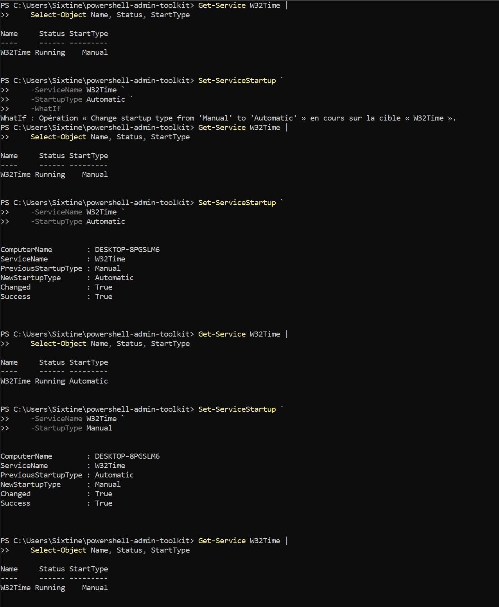
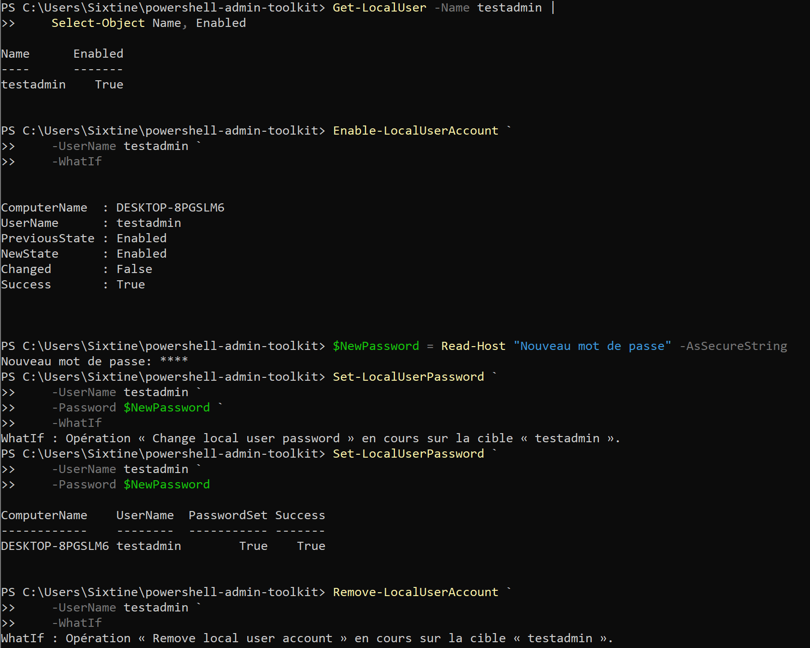
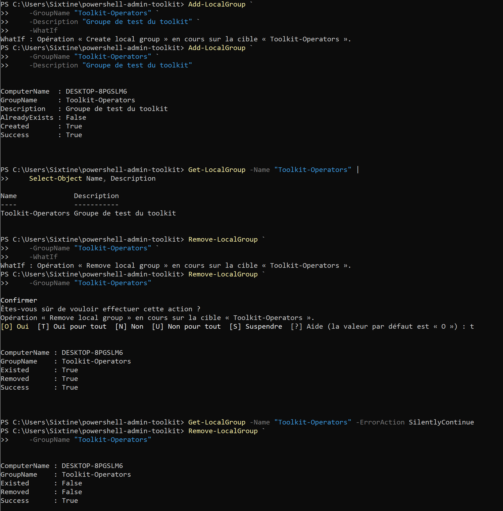
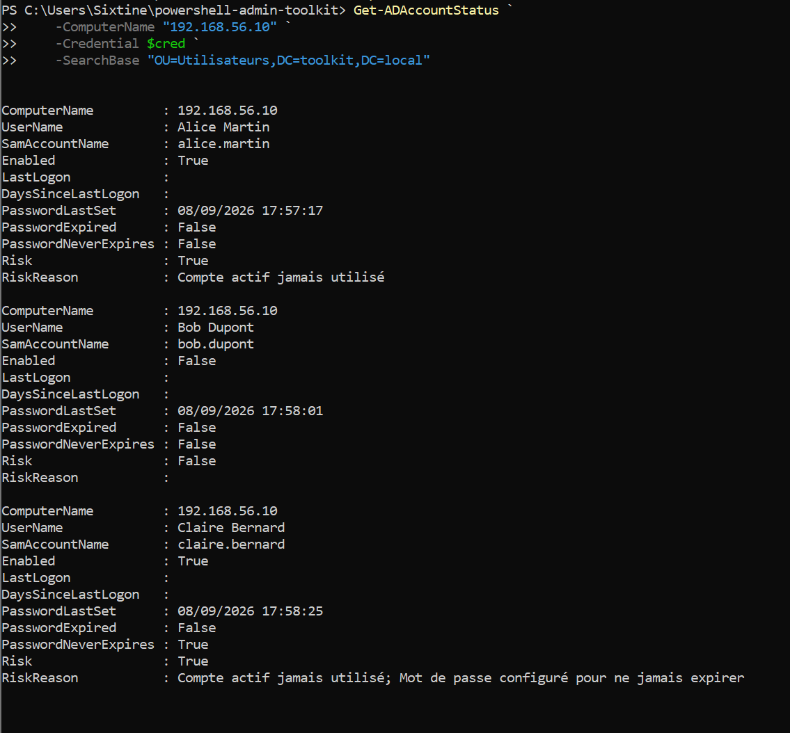
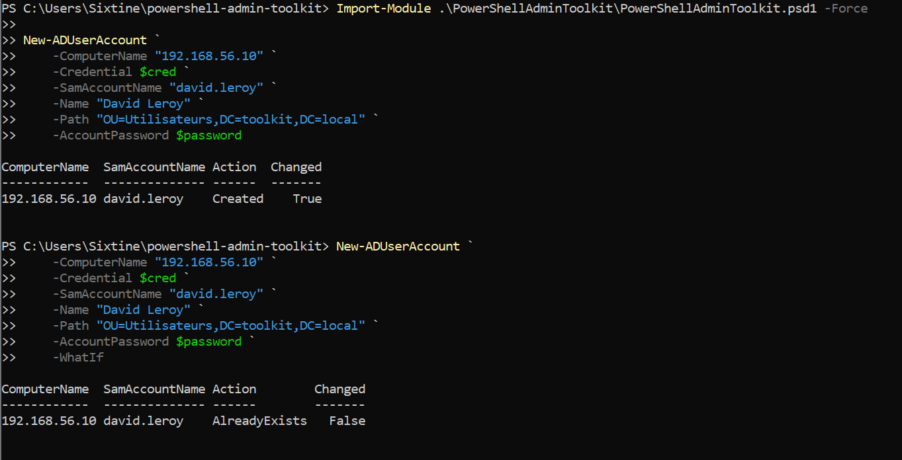
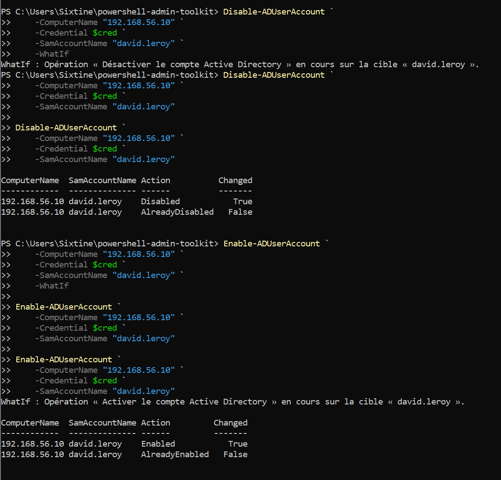
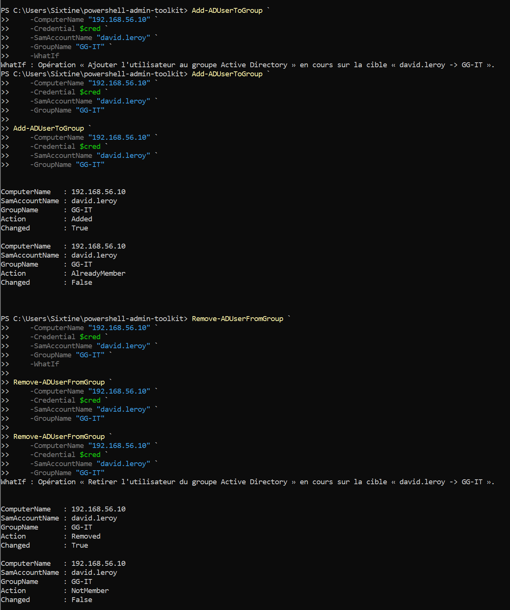
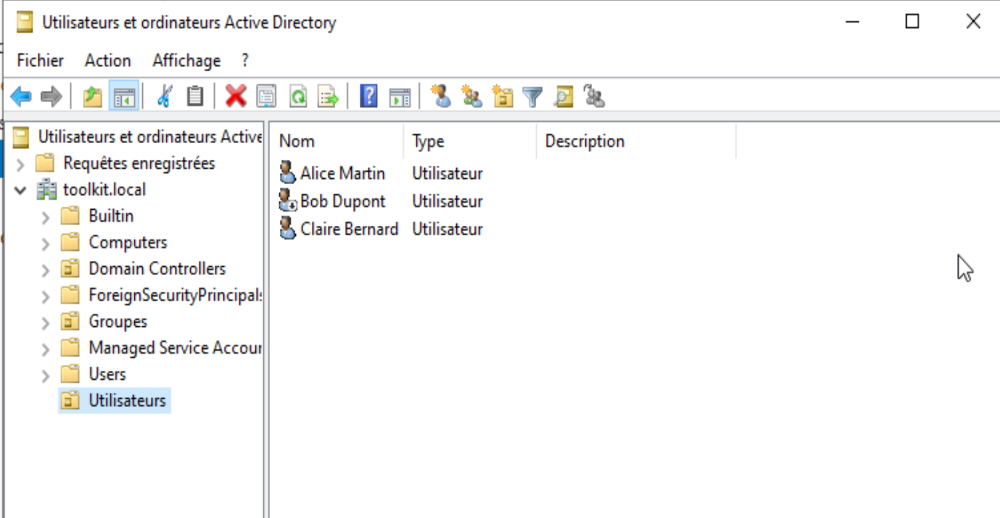
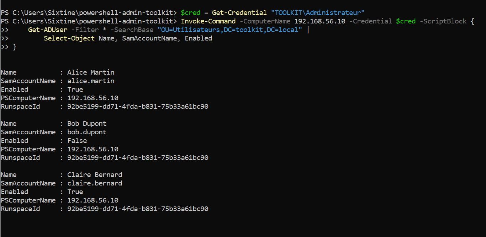
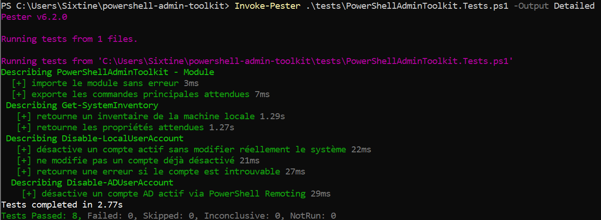

# PowerShell Admin Toolkit

Toolkit PowerShell conçu pour automatiser des tâches courantes de **diagnostic et d'administration de systèmes Windows**.

L'objectif est double : construire des outils réutilisables pour l'administration d'un environnement Windows et mettre en pratique les principaux concepts PowerShell sur des cas d'usage concrets : inventaire, diagnostic, gestion des services, comptes locaux et administration Active Directory.

---

## Fonctionnalités

### Inventaire système

`Get-SystemInventory` collecte les principales informations d'une machine Windows : système d'exploitation, uptime, CPU, RAM, IPv4, constructeur, modèle et stockage.

```powershell
Get-SystemInventory
Get-SystemInventory | Select-Object ComputerName, OS, RAM_GB
Get-SystemInventory -ComputerName SRV01
```

`Export-SystemInventory` permet d'exporter les objets obtenus vers CSV.

```powershell
Get-SystemInventory |
    Export-SystemInventory -Path .\inventory.csv
```

### Services Windows

`Get-ServiceHealth` contrôle l'état des services et leur type de démarrage.

```powershell
Get-ServiceHealth -ServiceName WinRM,W32Time,EventLog

Get-ServiceHealth |
    Where-Object Healthy -eq $false
```

`Show-ServiceHealth` fournit une vue interactive destinée à une consultation rapide.

```powershell
Show-ServiceHealth -ServiceName AdobeARMservice,EventLog
```


`Set-ServiceStartup` permet de modifier de manière contrôlée le type de démarrage d'un service.

```powershell
Set-ServiceStartup -ServiceName W32Time -StartupType Automatic
Set-ServiceStartup -ServiceName W32Time -StartupType Automatic -WhatIf
```



### Diagnostic réseau

`Test-NetworkConnectivity` regroupe plusieurs contrôles : résolution DNS, adresses IP, ICMP et ports TCP.

```powershell
Test-NetworkConnectivity -ComputerName google.com -Port 80,443

Test-NetworkConnectivity -ComputerName SRV01,SRV02 -Port 443,3389 |
    Where-Object TcpOpen -eq $false
```


### Journaux d'événements Windows

`Get-EventLogSummary` produit une synthèse des événements d'un journal Windows sur une période donnée.

```powershell
Get-EventLogSummary
Get-EventLogSummary -LogName Application -LastHours 24
```


---

## Administration des comptes locaux

### Analyse des comptes

`Get-LocalAccountStatus` inventorie les comptes locaux et effectue plusieurs contrôles liés à leur état et à leur utilisation.

```powershell
Get-LocalAccountStatus

Get-LocalAccountStatus |
    Where-Object Risk -ne 'OK'
```

Les comptes intégrés Administrator et Guest sont identifiés à partir de leur **SID/RID**, indépendamment de la langue de Windows ou d'un éventuel renommage.

La fonction peut notamment signaler un compte intégré sensible activé, un compte actif n'ayant jamais ouvert de session ou un compte inutilisé depuis un seuil configurable.

```powershell
Get-LocalAccountStatus -InactiveDays 60
```


### Cycle de vie des utilisateurs

```powershell
$Password = Read-Host "Mot de passe" -AsSecureString

New-LocalUserAccount `
    -UserName "demouser" `
    -Password $Password `
    -FullName "Utilisateur de démonstration" `
    -Description "Compte de test du toolkit"

Disable-LocalUserAccount -UserName demouser
Enable-LocalUserAccount -UserName demouser

$NewPassword = Read-Host "Nouveau mot de passe" -AsSecureString
Set-LocalUserPassword -UserName demouser -Password $NewPassword

Remove-LocalUserAccount -UserName demouser
```

Les fonctions de modification prennent en charge `ShouldProcess`, permettant notamment l'utilisation de `-WhatIf` et `-Confirm`.



---

## Administration des groupes locaux

Création et suppression de groupes :

```powershell
Add-LocalGroup `
    -GroupName "Toolkit-Operators" `
    -Description "Groupe de test du toolkit"

Remove-LocalGroup -GroupName "Toolkit-Operators"
```

Gestion de l'appartenance d'un utilisateur :

```powershell
Add-LocalUserToGroup `
    -UserName testadmin `
    -GroupName Utilisateurs

Remove-LocalUserFromGroup `
    -UserName testadmin `
    -GroupName Utilisateurs
```

Les fonctions vérifient l'état existant afin d'éviter les modifications inutiles et retournent des objets structurés indiquant le résultat de l'opération.



---

## Administration Active Directory

La partie Active Directory du toolkit est testée dans un laboratoire dédié sous **Windows Server 2022 Standard Evaluation**.

Elle couvre volontairement un ensemble restreint d'opérations courantes d'administration :

- audit des comptes utilisateurs ;
- création d'utilisateurs ;
- activation et désactivation de comptes ;
- ajout et retrait d'utilisateurs dans les groupes.

### Audit des comptes AD

`Get-ADAccountStatus` analyse les comptes utilisateurs et met en évidence plusieurs situations à contrôler :

- compte actif n'ayant jamais ouvert de session ;
- compte inactif depuis un seuil configurable ;
- mot de passe expiré ;
- mot de passe configuré pour ne jamais expirer.

```powershell
Get-ADAccountStatus `
    -ComputerName "192.168.56.10" `
    -Credential $cred `
    -SearchBase "OU=Utilisateurs,DC=toolkit,DC=local"
```



### Création d'un utilisateur AD

```powershell
$password = Read-Host "Mot de passe du nouvel utilisateur" -AsSecureString

New-ADUserAccount `
    -ComputerName "192.168.56.10" `
    -Credential $cred `
    -SamAccountName "david.leroy" `
    -Name "David Leroy" `
    -Path "OU=Utilisateurs,DC=toolkit,DC=local" `
    -AccountPassword $password
```

La fonction vérifie l'existence du compte avant création. Une nouvelle exécution sur un compte existant ne provoque pas de nouvelle modification.



### Activation et désactivation

```powershell
Disable-ADUserAccount `
    -ComputerName "192.168.56.10" `
    -Credential $cred `
    -SamAccountName "david.leroy"

Enable-ADUserAccount `
    -ComputerName "192.168.56.10" `
    -Credential $cred `
    -SamAccountName "david.leroy"
```

Les fonctions vérifient l'état existant du compte avant modification et prennent en charge `-WhatIf`.



### Appartenance aux groupes AD

```powershell
Add-ADUserToGroup `
    -ComputerName "192.168.56.10" `
    -Credential $cred `
    -SamAccountName "david.leroy" `
    -GroupName "GG-IT"

Remove-ADUserFromGroup `
    -ComputerName "192.168.56.10" `
    -Credential $cred `
    -SamAccountName "david.leroy" `
    -GroupName "GG-IT"
```

L'ajout et le retrait sont idempotents : si l'état demandé est déjà atteint, aucune modification supplémentaire n'est effectuée.



---

## Architecture du laboratoire Active Directory

Le laboratoire permet de développer le toolkit sur la machine hôte tout en exécutant les opérations Active Directory dans un environnement Windows Server isolé.

### Environnement utilisé

| Élément | Configuration |
| --- | --- |
| Poste hôte | Windows 11 Home |
| Hyperviseur | Oracle VirtualBox |
| Machine virtuelle | Windows Server 2022 Standard Evaluation |
| Contrôleur de domaine | `DC01` |
| Domaine / forêt | `toolkit.local` |
| Nom NetBIOS | `TOOLKIT` |
| Rôles serveur | Active Directory Domain Services (AD DS) + DNS |
| Réseau d'administration | VirtualBox Host-Only `192.168.56.0/24` |
| Adresse de `DC01` | `192.168.56.10` |
| Accès Internet de la VM | Adaptateur VirtualBox NAT |
| Administration distante | PowerShell Remoting / WinRM |

```text
Poste hôte - Windows 11 Home
        |
        | WinRM / PowerShell Remoting
        | Réseau Host-Only 192.168.56.0/24
        v
DC01 - Windows Server 2022 (VirtualBox)
        |-- 192.168.56.10
        |-- AD DS + DNS
        |-- Domaine toolkit.local
        |-- Module ActiveDirectory
        |
        +-- NAT --> Internet
```



### Contrainte Windows Home et solution retenue

Le scénario initial prévoyait d'installer les outils **RSAT Active Directory** directement sur le poste hôte afin d'y utiliser le module PowerShell `ActiveDirectory`.

Le poste de développement fonctionne cependant sous **Windows 11 Home**. Lors des tests, la fonctionnalité `Rsat.ActiveDirectory.DS-LDS.Tools` restait dans l'état `Staged` et le module `ActiveDirectory` n'était pas disponible depuis l'hôte.

Plutôt que de modifier l'édition de Windows ou de déplacer le développement du toolkit dans la VM, l'architecture a été adaptée :

1. le toolkit reste développé et lancé depuis le poste hôte ;
2. une session PowerShell distante est établie vers `DC01` ;
3. les commandes nécessitant le module `ActiveDirectory` sont exécutées sur le contrôleur de domaine via `Invoke-Command` ;
4. les objets PowerShell obtenus sont retournés au poste hôte.

Exemple de validation depuis l'hôte :

```powershell
$cred = Get-Credential "TOOLKIT\Administrateur"

Invoke-Command `
    -ComputerName 192.168.56.10 `
    -Credential $cred `
    -ScriptBlock {
        Get-ADUser -Filter * `
            -SearchBase "OU=Utilisateurs,DC=toolkit,DC=local" |
            Select-Object Name, SamAccountName, Enabled
    }
```



### Sécurité de l'administration distante

Le laboratoire utilise un réseau **Host-Only** dédié aux échanges entre le poste hôte et `DC01`.

Comme la connexion WinRM est réalisée vers une adresse IP et que le poste hôte n'est pas membre du domaine `toolkit.local`, `192.168.56.10` est explicitement ajouté aux `TrustedHosts` du client WinRM.

```powershell
Set-Item WSMan:\localhost\Client\TrustedHosts -Value "192.168.56.10"
```

Seul le contrôleur de domaine du laboratoire est déclaré comme hôte de confiance.

Les règles WinRM **entrantes du poste hôte restent désactivées** : celui-ci agit comme client d'administration et n'est pas exposé comme serveur WinRM. Les identifiants du domaine sont demandés avec `Get-Credential` et ne sont pas stockés dans le code.

Cette configuration permet de conserver un laboratoire simple et reproductible tout en séparant clairement le poste de développement du serveur Active Directory.

---

## Utilisation

Importer le module depuis la racine du projet :

```powershell
Import-Module .\PowerShellAdminToolkit\PowerShellAdminToolkit.psd1 -Force
```

Afficher les commandes disponibles :

```powershell
Get-Command -Module PowerShellAdminToolkit
```

Les principales commandes du toolkit sont :

```text
Add-ADUserToGroup
Add-LocalGroup
Add-LocalUserToGroup
Disable-ADUserAccount
Disable-LocalUserAccount
Enable-ADUserAccount
Enable-LocalUserAccount
Export-SystemInventory
Get-ADAccountStatus
Get-EventLogSummary
Get-LocalAccountStatus
Get-ServiceHealth
Get-SystemInventory
New-ADUserAccount
New-LocalUserAccount
Remove-ADUserFromGroup
Remove-LocalGroup
Remove-LocalUserAccount
Remove-LocalUserFromGroup
Set-LocalUserPassword
Set-ServiceStartup
Show-ServiceHealth
Test-NetworkConnectivity
```

---

## Sécurité et idempotence

Les fonctions qui modifient le système utilisent les mécanismes standards de PowerShell.

`-WhatIf` permet de visualiser une action sans l'exécuter :

```powershell
Remove-LocalUserAccount -UserName testuser -WhatIf
```

`-Confirm` permet de demander une confirmation avant une opération sensible :

```powershell
Remove-LocalGroup -GroupName "Toolkit-Operators" -Confirm
```

Lorsque cela est pertinent, l'état actuel est vérifié avant modification. Une opération déjà appliquée ne provoque donc pas de changement inutile.

Exemple :

```text
ComputerName   SamAccountName   Action           Changed
------------   --------------   ------           -------
192.168.56.10  david.leroy      AlreadyEnabled   False
```

Cette logique est également appliquée aux fonctions Active Directory lorsqu'un utilisateur est déjà activé, désactivé ou membre d'un groupe.

---

## Administration distante

Plusieurs fonctions du toolkit sont conçues pour fonctionner localement ou à distance.

```powershell
Get-SystemInventory -ComputerName SRV01
Get-LocalAccountStatus -ComputerName SRV01,SRV02
```

Pour la partie Active Directory du laboratoire, l'administration distante répond également à une contrainte d'environnement : le module `ActiveDirectory` est exécuté sur `DC01`, tandis que les fonctions du toolkit sont appelées depuis le poste hôte.

---

## Tests automatisés avec Pester

Le toolkit dispose d’une suite de tests automatisés réalisée avec **Pester 6.2.0**. Elle valide des comportements représentatifs du module sans exécuter d’actions dangereuses sur le poste ou le contrôleur de domaine.

La suite couvre notamment :

- l’import du module ;
- la présence des principales commandes exportées ;
- l’exécution et la structure de sortie de `Get-SystemInventory` ;
- la désactivation d’un compte local avec des **mocks**, sans modifier réellement le système ;
- le comportement idempotent lorsqu’un compte est déjà désactivé ;
- la gestion d’un compte local introuvable ;
- le workflow Active Directory distant en simulant les appels `Invoke-Command`, sans connexion réelle au contrôleur de domaine.

Exécution depuis la racine du projet :

```powershell
Invoke-Pester .\tests\PowerShellAdminToolkit.Tests.ps1 -Output Detailed
```

Résultat de la suite actuelle : **8 tests réussis, 0 échec**.



---

## Structure du projet

```text
powershell-admin-toolkit/
│
├── README.md
├── config/
├── docs/
│   └── screenshots/
│       ├── ad-account-status.png
│       ├── ad-group-membership.png
│       ├── ad-lab-users.png
│       ├── ad-remote-query.png
│       ├── ad-user-creation.png
│       ├── ad-user-lifecycle.png
│       ├── event-log-summary.png
│       ├── local-account-status.png
│       ├── local-group-management.png
│       ├── local-group-membership.png
│       ├── local-user-creation.png
│       ├── local-user-disable.png
│       ├── local-user-lifecycle.png
│       ├── network-connectivity.png
│       ├── pester-tests.png
│       ├── service-health.png
│       └── service-startup.png
│
├── examples/
│   └── usage-examples.ps1
│
├── PowerShellAdminToolkit/
│   ├── PowerShellAdminToolkit.psd1
│   ├── PowerShellAdminToolkit.psm1
│   ├── Private/
│   │   └── Write-ToolkitLog.ps1
│   └── Public/
│       ├── Add-ADUserToGroup.ps1
│       ├── Add-LocalGroup.ps1
│       ├── Add-LocalUserToGroup.ps1
│       ├── Disable-ADUserAccount.ps1
│       ├── Disable-LocalUserAccount.ps1
│       ├── Enable-ADUserAccount.ps1
│       ├── Enable-LocalUserAccount.ps1
│       ├── Export-SystemInventory.ps1
│       ├── Get-ADAccountStatus.ps1
│       ├── Get-EventLogSummary.ps1
│       ├── Get-LocalAccountStatus.ps1
│       ├── Get-ServiceHealth.ps1
│       ├── Get-SystemInventory.ps1
│       ├── New-ADUserAccount.ps1
│       ├── New-LocalUserAccount.ps1
│       ├── Remove-ADUserFromGroup.ps1
│       ├── Remove-LocalGroup.ps1
│       ├── Remove-LocalUserAccount.ps1
│       ├── Remove-LocalUserFromGroup.ps1
│       ├── Set-LocalUserPassword.ps1
│       ├── Set-ServiceStartup.ps1
│       ├── Show-ServiceHealth.ps1
│       └── Test-NetworkConnectivity.ps1
│
└── tests/
    └── PowerShellAdminToolkit.Tests.ps1
```

---

## Concepts PowerShell mis en œuvre

Le projet met notamment en pratique :

- fonctions avancées avec `[CmdletBinding()]` ;
- paramètres typés et validation ;
- pipeline et `[PSCustomObject]` ;
- CIM et PowerShell Remoting ;
- gestion des erreurs avec `try`, `catch` et `finally` ;
- modules `.psm1` et manifestes `.psd1` ;
- interrogation système, réseau et journaux Windows ;
- gestion des comptes et groupes locaux ;
- administration Active Directory ;
- exécution distante via WinRM et `Invoke-Command` ;
- `SecureString` et `PSCredential` pour les identifiants ;
- manipulation et analyse des SID Windows ;
- `ShouldProcess`, `-WhatIf` et `-Confirm` ;
- opérations idempotentes avec vérification de l'état existant ;
- export et exploitation de données structurées ;
- tests automatisés avec Pester et utilisation de mocks.

---

## Compatibilité et prérequis

Le toolkit est développé pour les environnements Windows et Windows Server.

Selon les fonctions utilisées, il peut nécessiter :

- Windows PowerShell 5.1 ou une version ultérieure compatible ;
- `Microsoft.PowerShell.LocalAccounts` pour l'administration locale ;
- WinRM / PowerShell Remoting pour l'administration distante ;
- des privilèges administrateur pour les opérations modifiant le système ;
- le module `ActiveDirectory` sur la machine qui exécute les opérations AD ;
- **Pester 6.x** pour exécuter la suite de tests automatisés.

Le laboratoire de démonstration utilise **Windows 11 Home comme poste hôte**, **Oracle VirtualBox** comme hyperviseur et **Windows Server 2022 Standard Evaluation** comme contrôleur de domaine.

---

## Conclusion

Cette première version du **PowerShell Admin Toolkit** constitue un ensemble cohérent d'outils couvrant plusieurs situations représentatives de l'administration Windows : diagnostic système et réseau, gestion des services, administration des comptes et groupes locaux, ainsi qu'administration Active Directory à distance.

Au-delà des fonctionnalités elles-mêmes, le projet met en pratique une approche structurée de PowerShell : fonctions avancées, objets structurés, gestion des erreurs, `ShouldProcess`, `-WhatIf`, idempotence, utilisation de `SecureString` et `PSCredential`, PowerShell Remoting / WinRM et tests automatisés avec Pester.

Le périmètre actuel répond à l'objectif fixé pour cette première version : disposer d'un toolkit fonctionnel, testé et documenté permettant de démontrer concrètement l'automatisation de tâches d'administration Windows et Active Directory.

Le projet pourrait être étendu avec une couverture Pester plus large, de nouvelles opérations d'administration ou une gestion plus avancée de plusieurs machines distantes. Ces évolutions restent volontairement hors du périmètre actuel : l'objectif n'est pas de multiplier les fonctionnalités, mais de conserver un projet lisible, cohérent et représentatif des compétences mises en œuvre.
