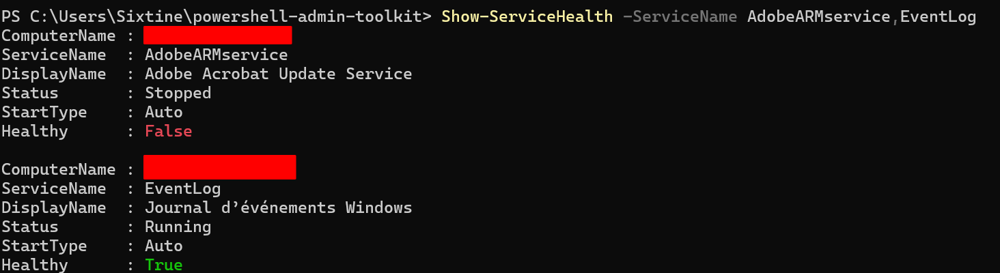
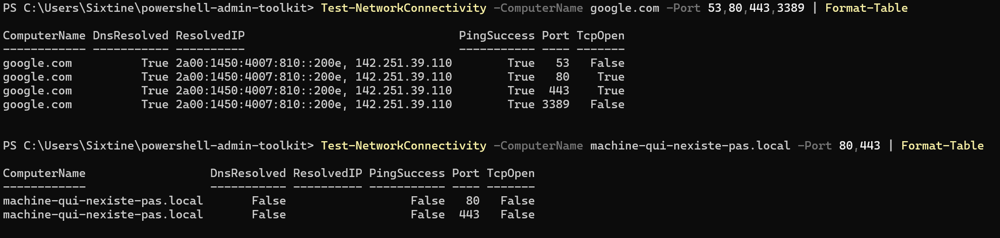
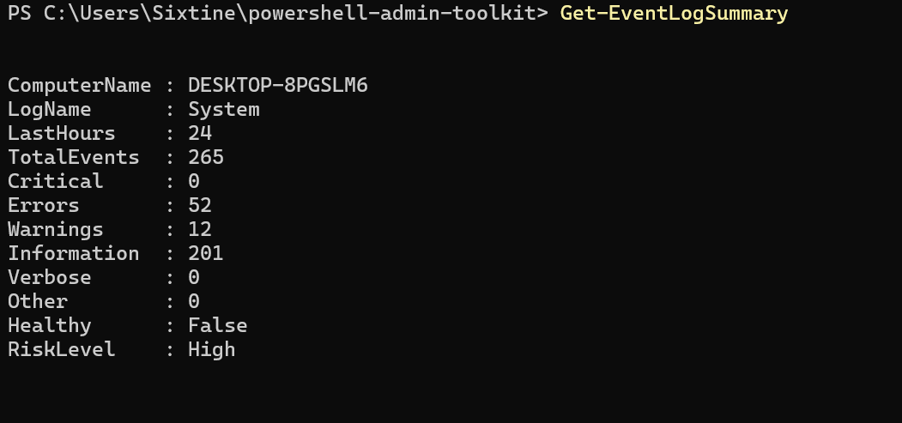
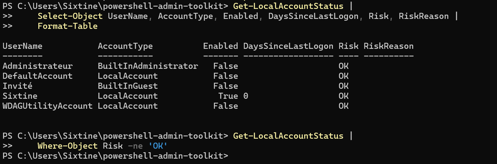

# PowerShell Admin Toolkit

Toolkit PowerShell conçu pour automatiser des tâches courantes d'**administration systèmes Windows**.

Ce projet a pour objectif de développer des outils réutilisables pour l'administration d'un parc Windows tout en mettant en pratique les principaux concepts de PowerShell : modules, fonctions avancées, pipeline, objets structurés, CIM et gestion des erreurs.

Le toolkit est développé progressivement autour de cas d'usage concrets rencontrés en administration systèmes.

---

## Fonctionnalités

### Inventaire système

La fonction `Get-SystemInventory` permet de collecter les principales informations matérielles et système d'une machine Windows :

- nom de la machine ;
- constructeur et modèle ;
- système d'exploitation et version ;
- uptime ;
- processeur ;
- mémoire RAM ;
- adresses IPv4 ;
- informations sur les disques et l'espace disponible.

La fonction fonctionne sur la machine locale et est conçue pour permettre également l'interrogation de machines distantes via **CIM / WinRM**.

Exemple :

```powershell
Get-SystemInventory
```

Il est également possible d'utiliser le pipeline PowerShell :

```powershell
$env:COMPUTERNAME | Get-SystemInventory
```

Ou de sélectionner uniquement certaines propriétés :

```powershell
Get-SystemInventory |
    Select-Object ComputerName, OS, RAM_GB
```

---

### Export de l'inventaire

La fonction `Export-SystemInventory` permet d'exporter les objets produits par `Get-SystemInventory` dans un fichier CSV exploitable pour du reporting ou un inventaire de parc.

Exemple :

```powershell
Get-SystemInventory |
    Export-SystemInventory -Path .\inventory.csv
```

Le fichier généré contient notamment :

```text
ComputerName
Manufacturer
Model
OS
OSVersion
UptimeDays
CPU
RAM_GB
IPv4
Disks
```

L'utilisation d'objets PowerShell structurés permet de conserver les données exploitables dans le pipeline plutôt que de produire uniquement du texte destiné à l'affichage.

---

### Supervision de l'état des services

La fonction `Get-ServiceHealth` permet de contrôler l'état de services Windows sur une ou plusieurs machines.

Pour chaque service analysé, la fonction retourne notamment :

- le nom de la machine ;
- le nom du service ;
- son nom d'affichage ;
- son état (`Running`, `Stopped`, etc.) ;
- son type de démarrage ;
- un indicateur `Healthy`.

Exemple :

```powershell
Get-ServiceHealth -ServiceName WinRM,W32Time,EventLog
```

La fonction ne considère pas automatiquement un service arrêté comme problématique.

Le type de démarrage est également pris en compte : un service configuré en démarrage automatique mais arrêté est considéré comme non sain.

```text
Status    StartType    Healthy
------    ---------    -------
Running   Auto         True
Stopped   Manual       True
Stopped   Auto         False
```

Les résultats retournés étant des objets PowerShell, ils peuvent être directement filtrés dans le pipeline.

Par exemple, pour afficher uniquement les services présentant une anomalie :

```powershell
Get-ServiceHealth |
    Where-Object Healthy -eq $false
```

---

### Affichage de l'état des services

La fonction `Show-ServiceHealth` fournit une vue destinée à une consultation interactive rapide par l'administrateur.

Elle s'appuie sur les résultats de `Get-ServiceHealth` et ajoute une représentation visuelle de l'indicateur de santé :

- `True` en vert ;
- `False` en rouge.

Exemple :

```powershell
Show-ServiceHealth -ServiceName AdobeARMservice,EventLog
```

Cette séparation permet de conserver `Get-ServiceHealth` comme une fonction produisant des objets exploitables pour l'automatisation, tout en proposant `Show-ServiceHealth` pour une lecture directe dans le terminal.



---

### Diagnostic de connectivité réseau

La fonction `Test-NetworkConnectivity` permet d'effectuer plusieurs contrôles de connectivité vers une ou plusieurs machines :

- résolution DNS ;
- récupération des adresses IP associées ;
- test de connectivité ICMP ;
- test de ports TCP ;
- interrogation de plusieurs machines et plusieurs ports.

Exemple :

```powershell
Test-NetworkConnectivity -ComputerName google.com -Port 80,443
```

La fonction retourne des objets PowerShell structurés contenant notamment :

```text
ComputerName
DnsResolved
ResolvedIP
PingSuccess
Port
TcpOpen
```

Plusieurs machines peuvent être testées simultanément :

```powershell
Test-NetworkConnectivity -ComputerName SRV01,SRV02 -Port 443,3389
```

Les résultats peuvent ensuite être exploités directement dans le pipeline. Par exemple, pour afficher uniquement les ports dont la connexion TCP a échoué :

```powershell
Test-NetworkConnectivity -ComputerName SRV01,SRV02 -Port 443,3389 |
    Where-Object TcpOpen -eq $false
```

Cette approche permet d'utiliser la fonction aussi bien pour un diagnostic ponctuel que comme composant d'un processus d'automatisation plus large.



---

### Analyse des journaux d'événements Windows

La fonction `Get-EventLogSummary` fournit une synthèse des événements présents dans un journal Windows sur une période donnée.

Elle permet notamment d'obtenir :

- le nombre total d'événements ;
- le nombre d'événements critiques ;
- le nombre d'erreurs ;
- le nombre d'avertissements ;
- le nombre d'événements d'information ;
- les événements de niveau verbose ou autres ;
- un indicateur `Healthy` ;
- un niveau de risque `RiskLevel`.

Exemple :

```powershell
Get-EventLogSummary
```

Il est possible de sélectionner le journal et la période à analyser :

```powershell
Get-EventLogSummary -LogName Application -LastHours 24
```

La fonction retourne un objet structuré de ce type :

```text
ComputerName
LogName
LastHours
TotalEvents
Critical
Errors
Warnings
Information
Verbose
Other
Healthy
RiskLevel
```

L'évaluation de l'état permet d'obtenir rapidement une indication synthétique de la santé du journal analysé tout en conservant le détail du nombre d'événements par niveau.



---

### Analyse des comptes locaux

La fonction `Get-LocalAccountStatus` permet d'inventorier les comptes utilisateurs locaux et d'effectuer plusieurs contrôles simples liés à leur état et à leur utilisation.

Pour chaque compte, la fonction retourne notamment :

- le nom de la machine ;
- le nom du compte ;
- son SID ;
- son type ;
- son état activé ou désactivé ;
- la date de dernière connexion ;
- le nombre de jours depuis la dernière connexion ;
- les propriétés liées au mot de passe ;
- un niveau de risque ;
- la raison d'une éventuelle alerte.

Exemple :

```powershell
Get-LocalAccountStatus
```

Les comptes intégrés `Administrator` et `Guest` sont identifiés à partir de leur **SID/RID** plutôt que de leur nom.

Cette méthode permet de reconnaître ces comptes indépendamment de la langue de Windows ou d'un éventuel renommage :

```text
RID -500    BuiltInAdministrator
RID -501    BuiltInGuest
```

La fonction signale notamment :

- un compte Administrateur intégré activé ;
- un compte Invité intégré activé ;
- un compte actif n'ayant jamais ouvert de session ;
- un compte actif inutilisé depuis un nombre configurable de jours.

Le seuil d'inactivité est fixé à 90 jours par défaut et peut être modifié :

```powershell
Get-LocalAccountStatus -InactiveDays 60
```

Les résultats peuvent être filtrés directement dans le pipeline afin de ne conserver que les comptes nécessitant une attention :

```powershell
Get-LocalAccountStatus |
    Where-Object Risk -ne 'OK'
```

Une vue synthétique peut également être obtenue :

```powershell
Get-LocalAccountStatus |
    Select-Object UserName, AccountType, Enabled, DaysSinceLastLogon, Risk, RiskReason |
    Format-Table
```



---

## Utilisation

Importer le module :

```powershell
Import-Module .\PowerShellAdminToolkit
```

Afficher les commandes disponibles :

```powershell
Get-Command -Module PowerShellAdminToolkit
```

Les commandes actuellement disponibles sont :

```text
Export-SystemInventory
Get-EventLogSummary
Get-LocalAccountStatus
Get-ServiceHealth
Get-SystemInventory
Show-ServiceHealth
Test-NetworkConnectivity
```

Pour obtenir davantage d'informations pendant l'exécution :

```powershell
Get-SystemInventory |
    Export-SystemInventory -Path .\inventory.csv -Verbose
```

---

## Administration distante

Plusieurs fonctions du toolkit sont conçues pour fonctionner aussi bien sur la machine locale que sur des machines distantes.

`Get-SystemInventory` permet par exemple d'interroger une machine distante :

```powershell
Get-SystemInventory -ComputerName SRV01
```

`Get-LocalAccountStatus` accepte également un ou plusieurs noms de machines :

```powershell
Get-LocalAccountStatus -ComputerName SRV01,SRV02
```

L'administration distante nécessite que les machines cibles soient accessibles et correctement configurées, notamment via **WinRM / PowerShell Remoting**.

Certaines fonctions acceptent également les entrées provenant du pipeline afin de faciliter leur intégration dans des traitements automatisés.

---

## Structure du projet

```text
powershell-admin-toolkit/
│
├── README.md
├── config/
├── docs/
│   └── screenshots/
│       ├── event-log-summary.png
│       ├── local-account-status.png
│       ├── network-connectivity.png
│       └── service-health.png
│
├── examples/
│   └── usage-examples.ps1
│
├── PowerShellAdminToolkit/
│   ├── PowerShellAdminToolkit.psd1
│   ├── PowerShellAdminToolkit.psm1
│   │
│   ├── Private/
│   │   └── Write-ToolkitLog.ps1
│   │
│   └── Public/
│       ├── Export-SystemInventory.ps1
│       ├── Get-EventLogSummary.ps1
│       ├── Get-LocalAccountStatus.ps1
│       ├── Get-ServiceHealth.ps1
│       ├── Get-SystemInventory.ps1
│       ├── Show-ServiceHealth.ps1
│       └── Test-NetworkConnectivity.ps1
│
└── tests/
    └── PowerShellAdminToolkit.Tests.ps1
```

Les fonctions du dossier `Public` constituent les commandes exposées par le module.

Les fonctions du dossier `Private` sont destinées au fonctionnement interne du toolkit et ne sont pas directement exposées à l'utilisateur.

---

## Concepts PowerShell mis en œuvre

Le projet met progressivement en pratique plusieurs mécanismes importants de PowerShell :

- fonctions avancées avec `[CmdletBinding()]` ;
- paramètres typés et validation ;
- utilisation du pipeline ;
- `begin`, `process` et `end` ;
- création d'objets avec `[PSCustomObject]` ;
- interrogation système avec CIM ;
- sessions CIM pour l'administration distante ;
- PowerShell Remoting avec `Invoke-Command` ;
- splatting de paramètres ;
- boucles `foreach` ;
- logique conditionnelle ;
- gestion des erreurs avec `try`, `catch` et `finally` ;
- séparation entre collecte de données et présentation ;
- modules PowerShell (`.psm1`) ;
- manifestes de modules (`.psd1`) ;
- export de données structurées vers CSV ;
- résolution DNS avec `Resolve-DnsName` ;
- diagnostic réseau avec `Test-Connection` et `Test-NetConnection` ;
- interrogation des journaux Windows avec `Get-WinEvent` ;
- interrogation des comptes locaux avec `Get-LocalUser` ;
- manipulation et analyse des SID Windows ;
- calcul de périodes et de durées avec les objets `DateTime` ;
- filtrage et exploitation des résultats via le pipeline.

---

## Compatibilité

Le module est actuellement développé pour :

- Windows 10 / Windows 11 ;
- Windows Server ;
- Windows PowerShell 5.1 et versions ultérieures.

Certaines fonctionnalités d'administration distante nécessitent une configuration appropriée de WinRM sur les machines cibles.

Les fonctions reposant sur les comptes utilisateurs locaux nécessitent également la disponibilité du module `Microsoft.PowerShell.LocalAccounts`.

---

## État du projet

Le projet est en cours de développement.

Les fonctionnalités actuellement opérationnelles comprennent :

- l'inventaire matériel et système ;
- l'export des inventaires au format CSV ;
- le contrôle de l'état des services Windows ;
- la détection de services automatiques anormalement arrêtés ;
- l'affichage interactif de l'état des services ;
- la résolution DNS d'une ou plusieurs cibles ;
- le test de connectivité ICMP ;
- le diagnostic de connectivité TCP sur un ou plusieurs ports ;
- la synthèse des journaux d'événements Windows ;
- le comptage des événements par niveau de sévérité ;
- l'évaluation synthétique de l'état des journaux ;
- l'inventaire des comptes utilisateurs locaux ;
- l'identification des comptes intégrés sensibles par SID ;
- la détection de comptes actifs inutilisés ou n'ayant jamais ouvert de session ;
- le filtrage et l'exploitation des résultats via le pipeline PowerShell.

Le toolkit se concentre actuellement principalement sur **l'inventaire, le diagnostic et l'analyse**.

Les prochaines étapes viseront progressivement à introduire des fonctions permettant également d'effectuer des **actions d'administration Windows**, ainsi qu'à renforcer les tests automatisés et la gestion des erreurs.